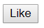
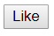

# React를 CDN으로 구현하기

## html에서 React를 사용해보자

1. CDN 소스 가져오기

- 개발용 버전

```html
<script
  crossorigin
  src="https://unpkg.com/react@16/umd/react.development.js"
></script>
<script
  crossorigin
  src="https://unpkg.com/react-dom@16/umd/react-dom.development.js"
></script>
```

- 배포용 버전

```html
<script
  crossorigin
  src="https://unpkg.com/react@16/umd/react.production.min.js"
></script>
<script
  crossorigin
  src="https://unpkg.com/react-dom@16/umd/react-dom.production.min.js"
></script>
```

- `react@16` 리액트가 동작하는 기본적인 코드들은 모두 react안에 들어있음
- `react-dom@16` 리액트 코드를 web에다 붙여주는 역할을 함

2. html 트리 구성하기

```html
<html>
  <head>
    <script
      crossorigin
      src="https://unpkg.com/react@16/umd/react.development.js"
    ></script>
    <script
      crossorigin
      src="https://unpkg.com/react-dom@16/umd/react-dom.development.js"
    ></script>
  </head>
  <body>
    <div id="root"></div>
  </body>
</html>
```

- `<div id="root"></div>`
  - 모든 엘리먼트를 React DOM에서 관리하기 때문에 이것을 "root DOM"이라고 부른다.
  - 우리는 ReactDOM으로 우리가 작성한 컴포넌트를 이 root에 붙여넣을 것이다.
- body 부분에 javascript code를 사용해서 간단한 버튼을 생성해 보자

3. LikeButton 만들기

```html
<html>
  <head>
    <script
      crossorigin
      src="https://unpkg.com/react@16/umd/react.development.js"
    ></script>
    <script
      crossorigin
      src="https://unpkg.com/react-dom@16/umd/react-dom.development.js"
    ></script>
  </head>
  <body>
    <div id="root"></div>
    <script>
      const e = React.createElement;

      class LikeButton extends React.Component {
        constructor(props) {
          super(props);
        }
        render() {
          return e("button", null, "Like"); // <button>Like</button>
        }
      }
    </script>
    <script>
      ReactDOM.render(e(LikeButton), document.querySelector("#root"));
    </script>
  </body>
</html>
```

`const e = React.createElement;`

- Tag를 만드는 함수

`class LikeButton extends React.Component`

- React안에 있는 Component를 상속

`constructor(props) {super(props);}`

- 제일 먼저 실행되는 함수로 props를 상속해옴

`return e("button", null, "Like");`

- <button>Like</button> 이라는 태그를 생성하**겠다**는 의미

`<script>ReactDOM.render(e(LikeButton),document.querySelector("#root"));</script>`

- LikeButton을 실제로 DOM에 **붙인다**는 의미

#### 결과화면 1



4. babel 사용하기
   - babel : 최신 문법, 실험적인 문법들을 javascript에서 사용할수 있게 해줌

`<script src="https://unpkg.com/babel-standalone@6/babel.min.js"></script>`

- 이 source를 삽입

```html
<head>
  <script
    crossorigin
    src="https://unpkg.com/react@16/umd/react.development.js"
  ></script>
  <script
    crossorigin
    src="https://unpkg.com/react-dom@16/umd/react-dom.development.js"
  ></script>
  <script src="https://unpkg.com/babel-standalone@6/babel.min.js"></script>
</head>
```

- babel을 사용하면 `return` 부분에 JSX를 사용할 수 있다.

`<button>Like</button>`

- 버튼 태그로 바꾸고

`<script>ReactDOM.render(e(LikeButton), document.querySelector("#root"))</script>`

ReactDOM 스크립트를

`<script type="text/babel">ReactDOM.render(<LikeButton />, document.querySelector("#root"));</script>`

바꾸어 준다.

`<script type="text/babel">`

script tag의 type을 babel로 명시해 줌으로서
React 컴포넌트를 처리할 수있다.

#### 결과화면 2



### Full Program

```html
<html>
  <head>
    <script
      crossorigin
      src="https://unpkg.com/react@16/umd/react.development.js"
    ></script>
    <script
      crossorigin
      src="https://unpkg.com/react-dom@16/umd/react-dom.development.js"
    ></script>
    <script src="https://unpkg.com/babel-standalone@6/babel.min.js"></script>
  </head>
  <body>
    <div id="root"></div>
    <script type="text/babel">
      const e = React.createElement;

      class LikeButton extends React.Component {
        constructor(props) {
          super(props);
        }
        render() {
          return <button>Like</button>;
        }
      }
    </script>
    <script type="text/babel">
      ReactDOM.render(<LikeButton />, document.querySelector("#root"));
    </script>
  </body>
</html>
```
